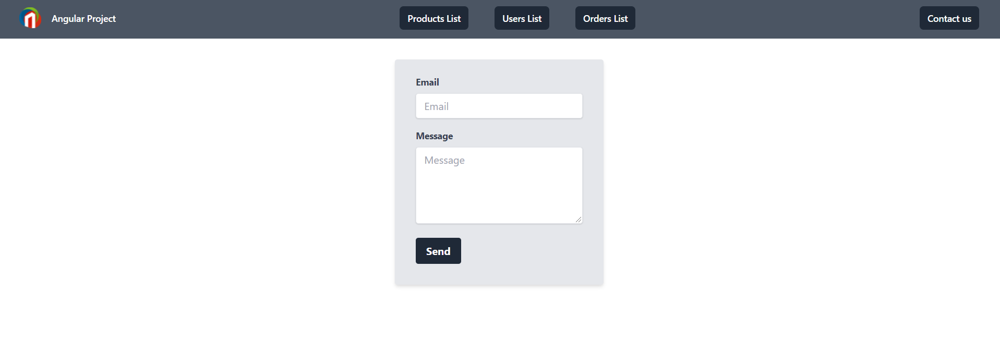

# Discover angular

This school project was generated with [Angular CLI](https://github.com/angular/angular-cli) version 13.0.1.

> Made by [Alexandre Anastassiades](https://github.com/AlexandreAnastassiades).

## Subject

The project is to develop a front-end app that displays :
- a navigation bar with
    - a link to products list
    - a link to users list
    - a link to orders list
    - a contact form

List are loaded from static json files stored in the backend.
Each list enables a click to a detail screen, showing the details of :
- a product
- a user
- an order

Contact form enables to enter an email and a message, with a button to send the message (an alert or a modal will be displayed with the content entered).

## Screenshots

## Modalities

Project has to be done individually or by pair.

## Technical stack

Front-end will be built using Angular.

An additional CSS lib can be used for a better design, but it is not mandatory.

## Deliverables

The expected deliverable will be a Git repo or a zip of your source code, with all your source files.

Send the URL of the Git repo or the zip by mail to your teacher thanks to Mootse.

Please send it for date 12/02/2022 at 00:00.

## Development server

Run `ng serve` for a dev server. Navigate to `http://localhost:4200/`. The app will automatically reload if you change any of the source files.